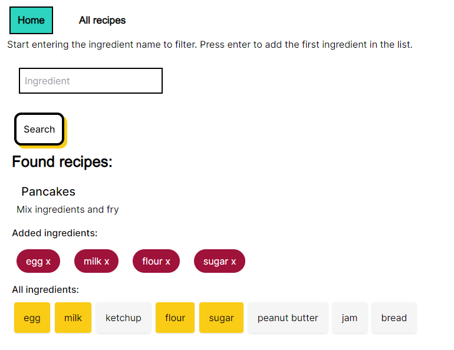

This is a [Next.js](https://nextjs.org/) project bootstrapped with [`create-next-app`](https://github.com/vercel/next.js/tree/canary/packages/create-next-app).

This is an app for users to find possible recipes from the ingredients they have. Built using Next.JS 13, Prisma, Supabase with PostgreSQL.

